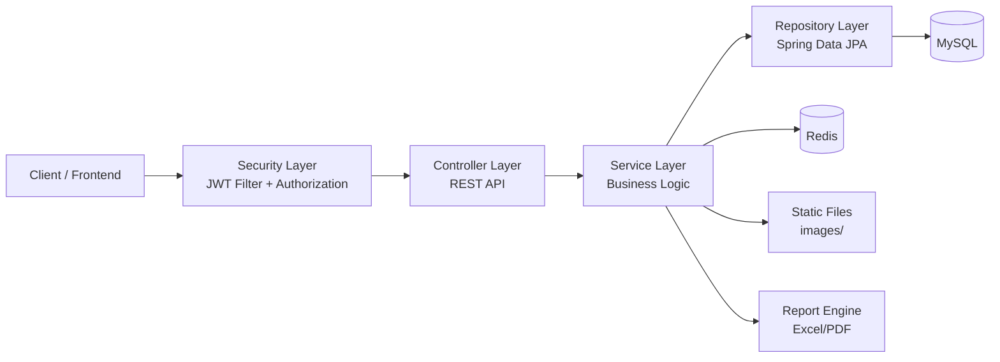
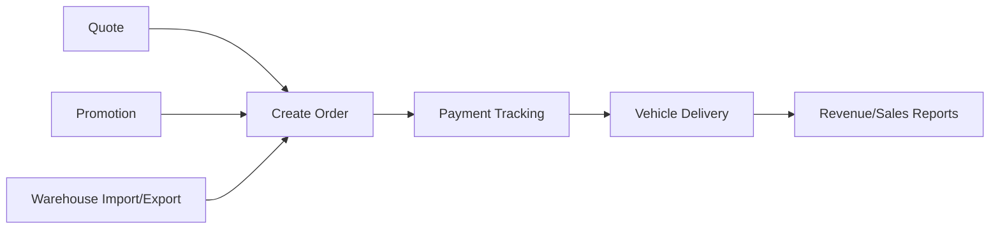

# EV Sales Management Backend API

[](https://www.oracle.com/java/)
[](https://spring.io/projects/spring-boot)
[](https://maven.apache.org/)
[](https://www.mysql.com/)
[](https://redis.io/)
[](https://jwt.io/)

Backend cho hệ thống quản lý kinh doanh xe điện theo mô hình đại lý, xây dựng theo kiến trúc nhiều lớp với các nghiệp vụ cốt lõi: quản lý đại lý, xe và cấu hình xe, báo giá, đơn hàng, thanh toán, giao xe, nhập xuất kho, khuyến mãi, phản hồi, lịch hẹn lái thử và báo cáo.

## 1. Công nghệ sử dụng

| Nhóm        | Công nghệ                              |
| ----------- | -------------------------------------- |
| Language    | Java 21                                |
| Framework   | Spring Boot 3.5.7, Spring MVC          |
| Security    | Spring Security, JWT (jjwt 0.11.5)     |
| Persistence | Spring Data JPA, Hibernate             |
| Database    | MySQL                                  |
| Cache       | Redis                                  |
| API Docs    | springdoc-openapi (Swagger UI 2.8.13)  |
| Validation  | Spring Validation (Jakarta Validation) |
| Build Tool  | Maven Wrapper                          |
| Reporting   | Apache POI, docx4j                     |

## 2. Kiến trúc tổng quan

### 2.1 Bức tranh hệ thống



### 2.2 Luồng xử lý request

1. Client gọi API vào Controller qua context-path `/api`.
2. Security layer xác thực JWT và kiểm tra quyền bằng `@PreAuthorize`.
3. Service xử lý nghiệp vụ chính (agency, vehicle, order, promotion, warehouse, report...).
4. Repository truy xuất MySQL bằng Spring Data JPA/Hibernate.
5. Redis được sử dụng cho cache để tăng tốc độ truy cập dữ liệu.

### 2.3 Luồng nghiệp vụ bán hàng tổng quát



## 3. Nghiệp vụ chính đã triển khai

- Xác thực và cấp token: `login`, `refresh-token`.
- Quản lý đại lý và bảng giá bán sỉ theo đại lý.
- Quản lý xe, dòng xe, chi tiết cấu hình xe.
- Quản lý khách hàng, nhân viên, role và trạng thái tài khoản.
- Quản lý báo giá, tạo đơn hàng từ báo giá, hủy/cập nhật đơn.
- Quản lý thanh toán theo khách hàng và đơn hàng.
- Quản lý khuyến mãi theo đại lý và theo nhóm xe.
- Quản lý nhập kho, xuất kho, giao xe.
- Quản lý phản hồi và xử lý phản hồi.
- Quản lý lịch hẹn lái thử.
- Báo cáo tồn kho, doanh thu, doanh số theo nhân viên/đại lý.
- Upload/xóa ảnh tài nguyên.

## 4. API modules

Base URL: `http://localhost:8080/api`

| Module                 | Endpoint base               |
| ---------------------- | --------------------------- |
| Auth                   | `/auth`                     |
| Agency                 | `/agency`                   |
| Agency Wholesale Price | `/agencyWholesalePrices`    |
| Category               | `/category`                 |
| Customer               | `/customers`                |
| Employee               | `/employees`                |
| Feedback               | `/feedback`                 |
| File Upload            | `/file-upload`              |
| Import Request         | `/import-request`           |
| Order                  | `/order`                    |
| Payment                | `/payments`                 |
| Policy                 | `/policy`                   |
| Promotion              | `/promotion`                |
| Quote                  | `/quote`                    |
| Vehicle                | `/vehicle`                  |
| Vehicle Deliveries     | `/vehicle-deliveries`       |
| Warehouse              | `/warehouse`                |
| Reports                | `/reports`, `/sales-report` |
| Test Drive             | `/test-drive-appointments`  |

Swagger UI: `http://localhost:8080/api/swagger-ui/index.html`

OpenAPI JSON: `http://localhost:8080/api/v3/api-docs`

## 5. Hướng dẫn tạo khuyến mãi

Endpoint tạo promotion:

- Method: `POST`
- URL: `http://localhost:8080/api/promotion`
- Quyền: `DEALER_MANAGER` hoặc `ADMIN` (Bearer Token)

### 5.1 Cách khuyến mãi hoạt động trong hệ thống

1. Request tạo promotion nhận payload theo `PromotionRequestDTO`.
2. Service tự động tính `status` khi tạo:
   - `ACTIVE`: `startDate < now < endDate`
   - `NOT_ACTIVE`: `now < startDate`
   - `INACTIVE`: `now >= endDate`
3. Promotion được gắn danh sách `vehicleTypeDetailsId` để áp dụng trên nhóm xe cụ thể.

### 5.2 Giá trị hợp lệ quan trọng

| Field           | Giá trị hợp lệ                     | Ý nghĩa                                        |
| --------------- | ---------------------------------- | ---------------------------------------------- |
| `promotionType` | `AMOUNT`, `PERCENTAGE`             | Kiểu giảm giá theo số tiền hoặc theo phần trăm |
| `status`        | `NOT_ACTIVE`, `ACTIVE`, `INACTIVE` | Trạng thái khuyến mãi                          |

Lưu ý:

- Khi `promotionType = AMOUNT`, ưu tiên sử dụng `discountAmount`.
- Khi `promotionType = PERCENTAGE`, ưu tiên sử dụng `discountPercent`.
- `vehicleTypeDetailsId` nên truyền danh sách id tồn tại trong hệ thống.

### 5.3 Cấu trúc request tạo promotion

```json
{
  "promotionName": "Giảm 5 triệu cho dòng xe A",
  "promotionType": "AMOUNT",
  "promotionValue": 5000000,
  "criteria": "Áp dụng cho xe thuộc dòng A trong tháng 3",
  "discountAmount": 5000000,
  "discountPercent": null,
  "startDate": "2026-03-27T08:00:00",
  "endDate": "2026-04-30T23:59:59",
  "status": "NOT_ACTIVE",
  "vehicleTypeDetailsId": [1, 2]
}
```

### 5.4 Curl mẫu để test nhanh

```bash
curl -X POST "http://localhost:8080/api/promotion" \
  -H "Authorization: Bearer <ACCESS_TOKEN>" \
  -H "Content-Type: application/json" \
  -d '{
    "promotionName": "GIAM10PHANTRAM_DONG_XE_A",
    "promotionType": "PERCENTAGE",
    "promotionValue": 10,
    "criteria": "Đơn thuộc nhóm xe A",
    "discountAmount": null,
    "discountPercent": 10,
    "startDate": "2026-03-27T08:00:00",
    "endDate": "2026-05-31T23:59:59",
    "status": "NOT_ACTIVE",
    "vehicleTypeDetailsId": [1]
  }'
```

### 5.5 Cách kiểm tra sau khi tạo

1. Gọi `GET /api/promotion?page=1&size=10` để kiểm tra danh sách.
2. Gọi `GET /api/promotion/{promotionId}` để kiểm tra chi tiết.
3. Nếu cần cập nhật: `PUT /api/promotion/{promotionId}`.
4. Nếu cần ngừng sử dụng: `DELETE /api/promotion/{promotionId}`.

## 6. Cấu trúc thư mục

```text
src/main/java/com/example/evsalesmanagement
|- config/        # Security, Redis, Swagger
|- controller/    # REST APIs
|- dto/           # Request/Response models
|- enums/         # Enum nghiệp vụ
|- exception/     # Global/business/security exception handling
|- filter/        # JWT filter
|- model/         # JPA entities
|- repository/    # Spring Data repositories
|- security/      # UserDetails và auth context
|- service/       # Business logic
|- utils/         # ApiResponse, JWT utilities, helper classes

src/main/resources
|- application.properties
|- application.properties.example
|- static/images/ # thư mục ảnh tĩnh
|- templates/     # template phục vụ xuất tài liệu
```

## 7. Chạy bằng Docker và khởi tạo dữ liệu ban đầu

### 7.1 Yêu cầu trước khi chạy Docker

- Đã cài Docker Desktop
- Docker Engine đang chạy
- Cổng `8080`, `3309`, `6379` chưa bị chiếm

### 7.2 Lệnh chạy Docker Compose

```bash
docker compose up -d --build
```

Kiểm tra container:

```bash
docker compose ps
```

Xem log ứng dụng:

```bash
docker compose logs -f app
```

Stop toàn bộ:

```bash
docker compose down
```

Stop và xóa luôn volume dữ liệu:

```bash
docker compose down -v
```

Ghi chú cấu hình Docker hiện tại:

- MySQL container: `evm-mysql`
- DB: `evm-db`
- MySQL user: `root`
- MySQL password: `root123`
- Redis host nội bộ: `redis`
- JWT secret lấy từ env `JWT_SECRET_KEY`

### 7.3 Luồng khởi tạo ứng dụng sau khi Docker chạy

Base URL:

- `http://localhost:8080/api`

Swagger UI:

- `http://localhost:8080/api/swagger-ui/index.html`

#### Bước 1: Đăng nhập tài khoản admin seed sẵn

`init.sql` đã seed 1 tài khoản admin:

- username: `admin_user`
- password plaintext theo ghi chú trong `init.sql`: `Evm123@`

```bash
curl -X POST "http://localhost:8080/api/auth/login" \
  -H "Content-Type: application/json" \
  -d '{
    "username": "admin_user",
    "password": "Evm123@"
  }'
```

Kết quả mong đợi:

- `success = true`
- có `accessToken` và `refreshToken` trong `data`

#### Bước 2: Upload ảnh

```bash
curl -X POST "http://localhost:8080/api/file-upload/image" \
  -H "Authorization: Bearer <ACCESS_TOKEN>" \
  -F "file=@vehicle-demo.png;type=image/png"
```

#### Bước 3: Tạo dữ liệu cơ bản

Sau khi có token admin, có thể tạo lần lượt:

- category (`POST /api/category`)
- vehicle (`POST /api/vehicle`)
- quote (`POST /api/quote`)
- order (`POST /api/order` hoặc `/api/order/from-quotation`)

### 7.4 Lỗi Docker Compose thường gặp

- Lỗi `port is already allocated`:
  - Đóng service đang chiếm cổng hoặc đổi map port trong `docker-compose.yml`.
- Lỗi build image thất bại:
  - Kiểm tra kết nối mạng để Maven tải dependency.
- App chưa kết nối được MySQL ngay khi start:
  - Chờ thêm vài giây, sau đó xem `docker compose logs -f app`.

## 8. Hướng dẫn chạy local (không dùng Docker)

### 8.1 Yêu cầu môi trường

- JDK 21
- Maven Wrapper (đã có sẵn trong dự án)
- MySQL
- Redis

### 8.2 Cấu hình

1. Sao chép file cấu hình:

```bash
cp src/main/resources/application.properties.example src/main/resources/application.properties
```

2. Điền các thông tin bắt buộc trong `application.properties`:

- `spring.datasource.url`
- `spring.datasource.username`
- `spring.datasource.password`
- `spring.datasource.driver-class-name`
- `spring.jpa.hibernate.ddl-auto`
- `jwt.secret-key`
- `spring.data.redis.host`
- `spring.data.redis.port`
- `spring.mail.username`, `spring.mail.password` (nếu sử dụng email)

### 8.3 Chạy ứng dụng

Windows:

```bash
./mvnw.cmd spring-boot:run
```

macOS/Linux:

```bash
./mvnw spring-boot:run
```

### 8.4 Chạy test

Windows:

```bash
./mvnw.cmd test
```

macOS/Linux:

```bash
./mvnw test
```

## 9. Bảo mật và chất lượng

- Stateless authentication với JWT.
- Phân quyền endpoint bằng `@PreAuthorize` theo role nghiệp vụ.
- Các endpoint công khai: `/auth/**`, `/swagger-ui/**`, `/v3/api-docs/**`, `/images/**`.
- Validation input bằng Jakarta Validation.
- Chuẩn hóa response qua `ApiResponse<T>`.
- Hỗ trợ upload file và báo cáo xuất Excel/PDF phục vụ vận hành.
