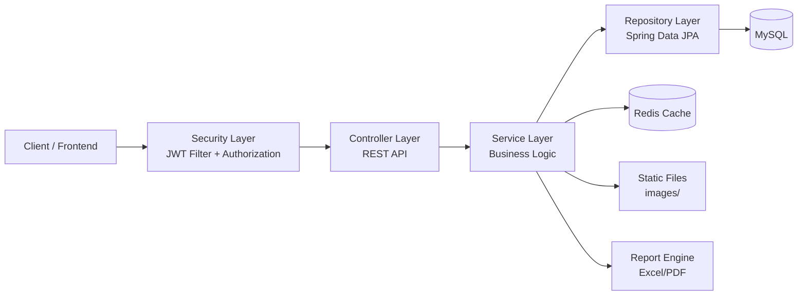

# EV Sales Management Backend API

[](https://www.oracle.com/java/)
[](https://spring.io/projects/spring-boot)
[](https://maven.apache.org/)
[](https://www.mysql.com/)
[](https://redis.io/)
[](https://jwt.io/)

Backend cho hệ thống quản lý kinh doanh xe điện theo mô hình đại lý, xây dựng theo kiến trúc nhiều lớp với các nhóm nghiệp vụ chính: quản lý xe và cấu hình xe, khách hàng, nhân sự, báo giá, đơn hàng, thanh toán, giao xe, nhập xuất kho, khuyến mãi, báo cáo doanh thu và lịch hẹn lái thử.

## 1. Công nghệ sử dụng

| Nhóm        | Công nghệ                              |
| ----------- | -------------------------------------- |
| Language    | Java 21                                |
| Framework   | Spring Boot 3.5.7, Spring MVC          |
| Security    | Spring Security, JWT (jjwt 0.11.5)     |
| Persistence | Spring Data JPA, Hibernate             |
| Database    | MySQL                                  |
| Cache       | Redis                                  |
| API Docs    | springdoc-openapi (Swagger UI 2.8.13)  |
| Validation  | Spring Validation (Jakarta Validation) |
| Build Tool  | Maven Wrapper                          |
| File/Export | Multipart Upload, Apache POI, docx4j   |

## 2. Kiến trúc tổng quan

### 2.1 Bức tranh hệ thống



### 2.2 Luồng xử lý request

1. Client gọi API vào Controller qua context-path `/api`.
2. Security Layer xác thực JWT bằng `JwtAuthFilter` và kiểm tra quyền truy cập bằng `@PreAuthorize`.
3. Service xử lý nghiệp vụ (agency, vehicle, order, report, warehouse, promotion...).
4. Repository truy xuất MySQL qua JPA/Hibernate.
5. Redis được dùng cho cache (TTL mặc định 30 phút theo `RedisConfig`).

## 3. Nghiệp vụ chính đã triển khai

- Xác thực và làm mới token: login, refresh token.
- Quản lý đại lý và bảng giá bán sỉ theo đại lý.
- Quản lý khách hàng, nhân viên, phân quyền theo vai trò.
- Quản lý xe, dòng xe, cấu hình chi tiết xe.
- Quản lý báo giá, tạo đơn từ báo giá, hủy đơn và theo dõi đơn.
- Quản lý thanh toán theo khách hàng.
- Quản lý khuyến mãi theo đại lý.
- Quản lý lịch hẹn lái thử.
- Quản lý nhập kho, xuất kho, giao xe.
- Báo cáo tồn kho, doanh thu, doanh số theo nhân viên/đại lý.
- Upload/xóa ảnh phục vụ dữ liệu xe và tài nguyên tĩnh.

## 4. API modules

Base URL: `http://localhost:8080/api`

| Module                   | Endpoint base              |
| ------------------------ | -------------------------- |
| Auth                     | `/auth`                    |
| Agency                   | `/agency`                  |
| Agency Wholesale Prices  | `/agencyWholesalePrices`   |
| Categories               | `/category`                |
| Customers                | `/customers`               |
| Employees                | `/employees`               |
| Feedback                 | `/feedback`                |
| File Upload              | `/file-upload`             |
| Import Request           | `/import-request`          |
| Orders                   | `/order`                   |
| Payments                 | `/payments`                |
| Policies                 | `/policy`                  |
| Promotions               | `/promotion`               |
| Quotes                   | `/quote`                   |
| Vehicles                 | `/vehicle`                 |
| Vehicle Deliveries       | `/vehicle-deliveries`      |
| Warehouse                | `/warehouse`               |
| Reports (Inventory/Rev.) | `/reports`                 |
| Sales Report             | `/sales-report`            |
| Test Drive Appointment   | `/test-drive-appointments` |

Swagger UI: `http://localhost:8080/api/swagger-ui/index.html`

OpenAPI JSON: `http://localhost:8080/api/v3/api-docs`

## 5. Cấu trúc thư mục

```text
src/main/java/com/example/evsalesmanagement
|- config/        # Security, Redis, Swagger
|- controller/    # REST APIs
|- dto/           # Request/Response models
|- enums/         # Enum nghiệp vụ
|- exception/     # Global/business/security exception handling
|- filter/        # JWT filter
|- model/         # JPA entities
|- repository/    # Spring Data repositories
|- security/      # UserDetails, auth context
|- service/       # Business logic
|- utils/         # ApiResponse, JWT utilities...

src/main/resources
|- application.properties
|- application.properties.example
|- static/images/ # thư mục ảnh tĩnh
|- templates/     # template phục vụ xuất tài liệu
```

## 6. Hướng dẫn chạy local

### 6.1 Yêu cầu môi trường

- JDK 21
- MySQL 8+
- Redis
- Maven Wrapper (đã có sẵn)

### 6.2 Cấu hình

1. Sao chép file cấu hình mẫu:

```bash
cp src/main/resources/application.properties.example src/main/resources/application.properties
```

2. Điền các thông tin bắt buộc trong `application.properties`:

- `spring.datasource.url`
- `spring.datasource.username`
- `spring.datasource.password`
- `spring.datasource.driver-class-name`
- `spring.jpa.hibernate.ddl-auto`
- `jwt.secret-key`
- `spring.mail.username`, `spring.mail.password` (nếu dùng email)
- `spring.data.redis.host`, `spring.data.redis.port`
- `image-upload-path` (nếu muốn đổi nơi lưu ảnh)

### 6.3 Chạy ứng dụng

Windows:

```bash
./mvnw.cmd spring-boot:run
```

macOS/Linux:

```bash
./mvnw spring-boot:run
```

Sau khi chạy thành công:

- API Base: `http://localhost:8080/api`
- Swagger UI: `http://localhost:8080/api/swagger-ui/index.html`

### 6.4 Chạy test

Windows:

```bash
./mvnw.cmd test
```

macOS/Linux:

```bash
./mvnw test
```

## 7. Khởi tạo dữ liệu mẫu

Project có sẵn file `FakeData.sql` để seed dữ liệu mẫu (vehicle type, agency, employee, customer...).

Gợi ý quy trình:

1. Tạo database MySQL phù hợp với cấu hình trong `application.properties`.
2. Chạy ứng dụng một lần để Hibernate tạo schema.
3. Import `FakeData.sql` vào database.
4. Kiểm tra dữ liệu qua Swagger UI.

## 8. Xác thực và phân quyền

- Ứng dụng dùng JWT stateless (`SessionCreationPolicy.STATELESS`).
- Public endpoints được mở trong `SecurityConfig`:
  - `/auth/**`
  - `/swagger-ui/**`
  - `/v3/api-docs/**`
  - `/images/**`
- Các endpoint còn lại yêu cầu token và quyền role bằng `@PreAuthorize`.

Ví dụ login:

```bash
curl -X POST "http://localhost:8080/api/auth/login" \
	-H "Content-Type: application/json" \
	-d '{
		"username": "your_username",
		"password": "your_password"
	}'
```

Refresh token:

```bash
curl -X POST "http://localhost:8080/api/auth/refresh-token?refreshToken=<REFRESH_TOKEN>"
```

## 9. Tài liệu bổ sung

- Tài liệu chi tiết module Test Drive Appointment: `TEST_DRIVE_API_DOCUMENTATION.md`

## 10. Ghi chú triển khai

- Context path hiện tại: `/api`.
- Upload ảnh mặc định vào: `src/main/resources/static/images`.
- Multipart đang cấu hình giới hạn `20MB` cho mỗi file/request.
- Redis cache mặc định TTL `30 phút`.
